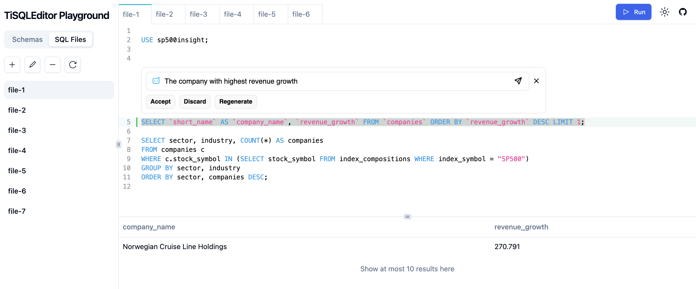
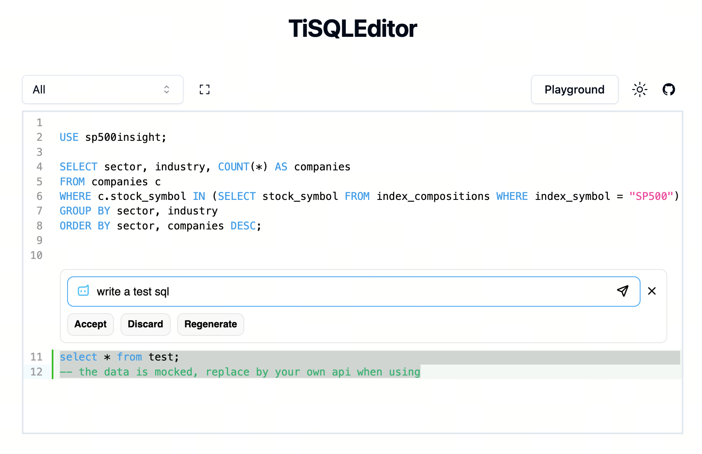

# TiSQLEditor

TiSQLEditor is a CodeMirror6 based SQL code editor which is used in TiDB Cloud Console.

- [Try Full Featured Playground](https://tisqleditor-playground.netlify.app/)



https://github.com/tidbcloud/tisqleditor/assets/1284531/732b600f-5b4e-45d3-a3d2-26479bd59d11

- [Try Simple Example](https://tisqleditor-playground.netlify.app/?example=all&with_select)



## Features

- Support edit multiple SQL files
- Supply React component (Vue component wip)
- Out of box extensions
- AI Widget to chat with AI to help write or refine SQL

## Packages

| package                                        | desc                                                                      |
| ---------------------------------------------- | ------------------------------------------------------------------------- |
| @tidbcloud/tisqleditor                         | SQLEditorInstance with pre-configured extensions                          |
| @tidbcloud/tisqleditor-react                   | React component wrapper                                                   |
| @tidbcloud/codemirror-extension-ai-widget      | a widget to chat with AI to help write or refine SQL by human language    |
| @tidbcloud/codemirror-extension-sql-parser     | parse the editor content to SQL statements                                |
| @tidbcloud/codemirror-extension-cur-sql        | get the selected SQL statements                                           |
| @tidbcloud/codemirror-extension-cur-sql-gutter | show gutter for the selected SQL statements                               |
| @tidbcloud/codemirror-extension-save-helper    | save the editor content if it changes                                     |
| @tidbcloud/codemirror-extension-autocomplete   | refine the original @codemirror/autocomplete to provides better style     |
| @tidbcloud/codemirror-extension-linters        |                                                                           |
| @tidbcloud/codemirror-extension-events         |                                                                           |
| @tidbcloud/codemirror-extension-themes         | 2 simple builtin themes, `bbedit` for light mode, `oneDark` for dark mode |
| @tidbcloud/codemirror-extension-basic-setup    |                                                                           |

## Usage

See [editor.tsx](./packages/playground/src/components/biz/editor-panel/editor.tsx) or [editor-example.tsx](./packages/playground/src/examples/editor-example.tsx) to get more details.

```tsx
import { SQLEditor } from '@tidbcloud/tisqleditor-react'
import { saveHelper } from '@tidbcloud/codemirror-extension-save-helper'
import { bbedit, oneDark } from '@tidbcloud/codemirror-extension-themes'
import { curSqlGutter } from '@tidbcloud/codemirror-extension-cur-sql-gutter'
import {
  useDbLinter,
  fullWidthCharLinter
} from '@tidbcloud/codemirror-extension-linters'
import { autoCompletion } from '@tidbcloud/codemirror-extension-autocomplete'
import {
  aiWidget,
  isUnifiedMergeViewActive
} from '@tidbcloud/codemirror-extension-ai-widget'

export function Editor() {
  const {
    api: { saveFile },
    state: { activeFileId, openedFiles }
  } = useFilesContext()

  const { isDark } = useTheme()

  const { schema } = useSchemaContext()
  const sqlConfig = useMemo(
    () => convertSchemaToSQLConfig(schema ?? []),
    [schema]
  )
  const getDbListRef = useRef<() => string[]>()
  getDbListRef.current = () => {
    return schema?.map((d) => d.name) || []
  }

  const chatCtx = useChatContext()

  const activeFile = useMemo(
    () => openedFiles.find((f) => f.id === activeFileId),
    [activeFileId, openedFiles]
  )

  const extraExts = useMemo(() => {
    if (activeFile && activeFile.status === 'loaded') {
      return [
        saveHelper({
          save: (view: EditorView) => {
            saveFile(activeFile.id, view.state.doc.toString())
          }
        }),
        autoCompletion(),
        curSqlGutter({
          whenHide: (view) => {
            return isUnifiedMergeViewActive(view.state)
          }
        }),
        useDbLinter(),
        fullWidthCharLinter(),
        aiWidget({
          chat(view, chatId, req) {
            const db = getCurDatabase(view.state)
            req['extra']['db'] = db
            return chatCtx.chat(chatId, { ...req })
          },
          cancelChat: chatCtx.cancelChat,
          onEvent(_view, type, payload) {
            chatCtx.onEvent(type, payload)
          },
          getDbList: getDbListRef.current!
        })
      ]
    }
    return []
  }, [activeFile])

  if (!activeFile) {
    return (
      <div className="h-full flex items-center justify-center">
        <h1 className="scroll-m-20 text-4xl font-extrabold tracking-tight lg:text-5xl">
          TiSQLEditor
        </h1>
      </div>
    )
  }

  if (activeFile.status === 'loading') {
    return (
      <SQLEditor
        className="h-full"
        editorId="loading"
        doc=""
        theme={isDark ? oneDark : bbedit}
        extraExts={[
          placeholder('loading...'),
          // both needed to prevent user from typing
          EditorView.editable.of(false),
          EditorState.readOnly.of(true)
        ]}
      />
    )
  }

  return (
    <SQLEditor
      className="h-full"
      editorId={activeFile.id}
      doc={activeFile.content}
      sqlConfig={sqlConfig}
      theme={isDark ? oneDark : bbedit}
      extraExts={extraExts}
    />
  )
}
```

## Development

### Setup

- node.js >18.16.0
- [enable corepack](https://www.totaltypescript.com/how-to-use-corepack): `corepack enable && corepack enable npm`

### Local Development

- `echo 'link-workspace-packages=true' >> ~/.npmrc`
- `pnpm i`
- `pnpm dev`

### Production Build

- `pnpm i`
- `pnpm build`

### PR Commit Convention

Before you create a pull request, please check whether your commits comply with the commit conventions used in this repository. When you create a commit, you should follow the convention `category(scope or module): message` in your commit message while using one of the following categories:

- feat/feature: all changes that introduce completely new code or new features
- fix: changes that fix a bug (ideally you will additionally reference an issue if present)
- refactor: any code related change that is not a fix nor a feature
- chore: all changes to the repository that do not fit into any of the above categories

### Release

- Checkout from the latest main branch.
- Run `pnpm changeset` and follow the instructions, you will need to tell it the version and changelogs.
- Commit the generated changeset file (a markdown file in `.changeset` folder), create a pull request to main branch.
- After your pull request is merged, a new pull request will be created by a bot, you can review your release there.
- After that pull request is merged, a new release will be published automatically to github registry.

## License

[MIT License](./LICENSE)
