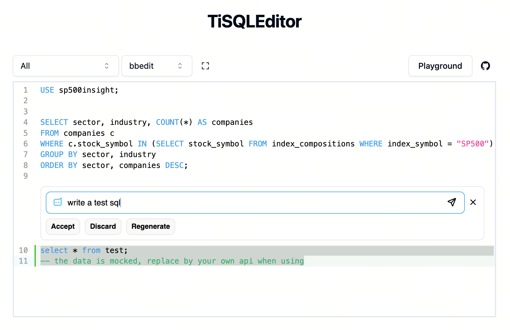

# TiSQLEditor

SQL Editor is built on [CodeMirror6](https://codemirror.net/), a modern code editor that is written in TypeScript and supports a wide range of extensions. Based on that, we provide a set of extensions to make it easy to use and easy to extend, all these features are validated in the [TiDB Cloud](https://tidbcloud.com), with countless customers all around the world. We also contribute to the CodeMirror6 project, and we are happy to share our extensions with the community.

👉🏻 [Try Full Featured Playground](https://tisqleditor.vercel.app/playground)


https://github.com/tidbcloud/tisqleditor/assets/1284531/732b600f-5b4e-45d3-a3d2-26479bd59d11

👉🏻 [Try Simple Example](https://tisqleditor.vercel.app/examples?ex=all)



## Features

- Support edit multiple SQL files
- Supply React component and Vue component
- Out of box extensions
- AI Widget to chat with AI to help write or refine SQL

## Packages

| package                                                                                              | desc                                                                      |
| ---------------------------------------------------------------------------------------------------- | ------------------------------------------------------------------------- |
| [@tidbcloud/tisqleditor](./packages/core/README.md)                                                  | SQLEditorInstance with pre-configured extensions                          |
| [@tidbcloud/tisqleditor-react](./packages/react/README.md)                                           | React component wrapper                                                   |
| [@tidbcloud/tisqleditor-vue](./packages/vue/README.md)                                               | Vue component wrapper                                                     |
| [@tidbcloud/codemirror-extension-ai-widget](./packages/extensions/ai-widget/README.md)               | A widget to chat with AI to help write or refine SQL                      |
| [@tidbcloud/codemirror-extension-sql-parser](./packages/extensions/sql-parser/README.md)             | Parse the editor content to SQL statements                                |
| [@tidbcloud/codemirror-extension-cur-sql](./packages/extensions/cur-sql/README.md)                   | Get the selected SQL statements                                           |
| [@tidbcloud/codemirror-extension-cur-sql-gutter](./packages/extensions/cur-sql-gutter/README.md)     | Show gutter for the selected SQL statements                               |
| [@tidbcloud/codemirror-extension-sql-autocomplete](./packages/extensions/sql-autocomplete/README.md) | SQL keyword and database schema autocomplete                              |
| [@tidbcloud/codemirror-extension-linters](./packages/extensions/linters/README.md)                   | Use db statement, full width chars, and regular expression linters        |
| [@tidbcloud/codemirror-extension-save-helper](./packages/extensions/save-helper/README.md)           | Save the editor content if it changes                                     |
| [@tidbcloud/codemirror-extension-events](./packages/extensions/events/README.md)                     | 2 normal kinds of event listener: doc change, selection change            |
| [@tidbcloud/codemirror-extension-themes](./packages/extensions/themes/README.md)                     | 2 simple builtin themes, `bbedit` for light mode, `oneDark` for dark mode |
| [@tidbcloud/codemirror-extension-basic-setup](./packages/extensions/basic-setup/README.md)           | Basic configuration for codemirror                                        |

## Usage

See [editor.tsx](./packages/playground/src/components/biz/editor-panel/editor.tsx) or [editor-example.tsx](./packages/playground/src/examples/editor-example.tsx) to get more details.

```shell
npm install @tidbcloud/tisqleditor-react @tidbcloud/codemirror-extension-themes @tidbcloud/codemirror-extension-cur-sql-gutter
```

```tsx
import { SQLEditor } from '@tidbcloud/tisqleditor-react'
import { oneDark } from '@tidbcloud/codemirror-extension-themes'
import { curSqlGutter } from '@tidbcloud/codemirror-extension-cur-sql-gutter'

export function Editor() {
  return (
    <SQLEditor
      editorId="MySQLEditor"
      doc={'USE game;\nSELECT * from games;'}
      theme={oneDark}
      basicSetupOptions={{
        autocompletion: true
      }}
      extraExts={[
        curSqlGutter()
        // here you can add some other extensions as you need
      ]}
    />
  )
}
```

## Documentation

- Official site: [https://tiui.tidbcloud.com/sql-editor](https://tiui.tidbcloud.com/sql-editor)
- Documentation: [https://tiui.tidbcloud.com/docs/sql-editor-getting-started](https://tiui.tidbcloud.com/docs/sql-editor-getting-started)

## Development

### Setup

- node.js > 20.0
- [enable corepack](https://www.totaltypescript.com/how-to-use-corepack): `corepack enable && corepack enable npm`

### Local Development

```bash
echo 'link-workspace-packages=true' >> ~/.npmrc
pnpm i
pnpm dev
```

### Production Build

```bash
pnpm i
pnpm build
```

### PR Commit Convention

Before you create a pull request, please check whether your commits comply with the commit conventions used in this repository. When you create a commit, you should follow the convention `category(scope or module): message` in your commit message while using one of the following categories:

- feat/feature: all changes that introduce completely new code or new features
- fix: changes that fix a bug (ideally you will additionally reference an issue if present)
- refactor: any code related change that is not a fix nor a feature
- chore: all changes to the repository that do not fit into any of the above categories

### Test

Run `pnpm test` to test.

```bash
pnpm test
```

### Release

- Checkout from the latest main branch.
- Run `pnpm changeset` and follow the instructions, you will need to tell it the version and changelogs.
- Commit the generated changeset file (a markdown file in `.changeset` folder), create a pull request to main branch.
- After your pull request is merged, a new pull request will be created by a bot, you can review your release there.
- After that pull request is merged, a new release will be published automatically to github registry.

## License

[MIT License](./LICENSE)
